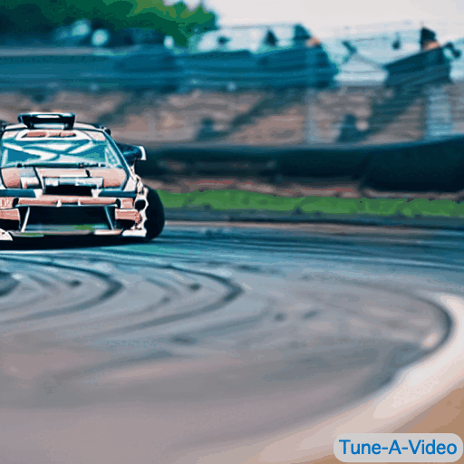
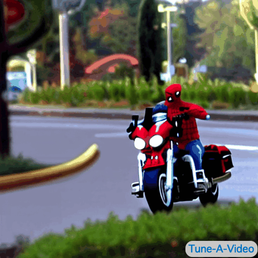
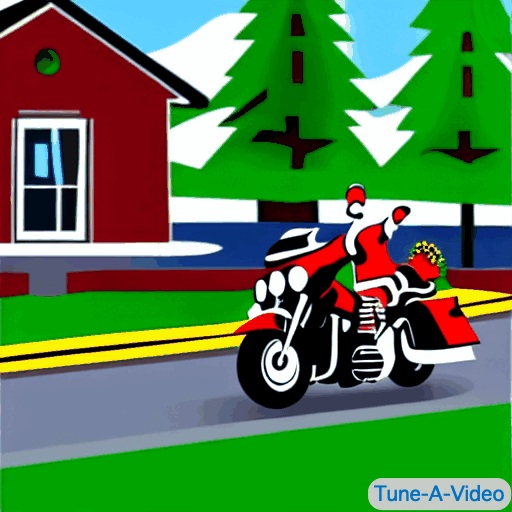
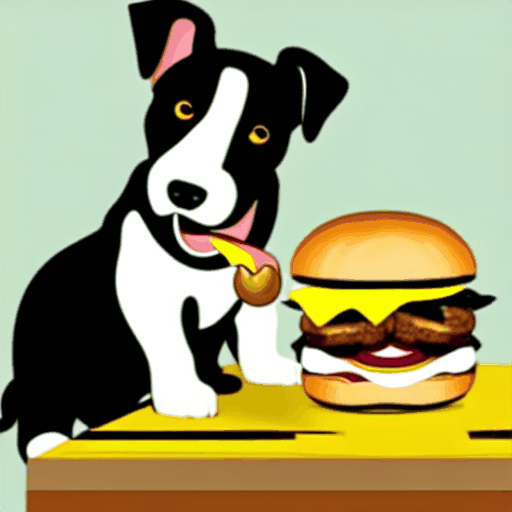

# Anonymous GitHub for Tune-A-Video

  
 
<em><b>Tune-A-Video</b>: A novel T2V generator trained on one text-video pair and pretrained T2I models.</em>

# Table of Content
- [Anonymous GitHub for Tune-A-Video](#anonymous-github-for-tune-a-video)
- [Table of Content](#table-of-content)
- [Sample Results](#sample-results)
  - [Pretrained T2I (Stable Diffusion)](#pretrained-t2i-stable-diffusion)
  - [Personalized Pretrained T2I (DreamBooth)](#personalized-pretrained-t2i-dreambooth)
  - [Pretrained T2I with Pose Control (T2I-Adapter)](#pretrained-t2i-with-pose-control-t2i-adapter)
- [Baseline Comparisons](#baseline-comparisons)
- [Ablation Study](#ablation-study)

# Sample Results

## Pretrained T2I (Stable Diffusion)

<table class="center">
<tr>
  <td width=25% style="text-align:center;"><b>Input Video</b></td>
  <td width=25% style="text-align:center;"><b>Output Video</b></td>
  <td width=25% style="text-align:center;"><b></b></td>
  <td width=25% style="text-align:center;"><b></b></td>
</tr>
<tr>
  <td></td>
  <td></td>
  <td></td>              
  <td></td>
</tr>
<tr>
  <td style="text-align:center;">"A man is dribbling a basketball"</td>
  <td style="text-align:center;">"James Bond is dribbling a basketball on the beach"</td>
  <td style="text-align:center;">"An astronaut is dribbling a basketball, cartoon style"</td>
  <td style="text-align:center;">"Iron Man is dribbling a basketball on the lawn"</td>
</tr>
<tr>
  <td></td>
  <td></td>
  <td></td>              
  <td></td>
</tr>
<tr>
  <td style="text-align:center;">"A man is skiing"</td>
  <td style="text-align:center;">"Spider Man is skiing on the beach, cartoon style"</td>
  <td style="text-align:center;">"Wonder Woman, wearing a cowboy hat, is skiing"</td>
  <td style="text-align:center;">"A man, wearing pink clothes, is skiing at sunset"</td>
</tr>
<tr>
  <td></td>
  <td></td>
  <td></td>              
  <td></td>
</tr>
<tr>
  <td style="text-align:center;">"A rabbit is eating a watermelon on the table"</td>
  <td style="text-align:center;">"A rabbit is <del>eating a watermelon</del> on the table"</td>
  <td style="text-align:center;">"A cat with sunglasses is eating a watermelon on the beach"</td>
  <td style="text-align:center;">"A puppy is eating a cheeseburger on the table, comic style"</td>
</tr>
<tr>
  <td></td>
  <td></td>
  <td></td>              
  <td></td>
</tr>
<tr>
  <td style="text-align:center;">"A lion is roaring"</td>
  <td style="text-align:center;">"A tiger is roaring"</td>
  <td style="text-align:center;">"A lion is roaring, Van Gogh style"</td>
  <td style="text-align:center;">"A wolf is roaring in New York City"</td>
</tr>
<!-- </table> -->

<!-- 

<b>CLICK ME FOR MORE EXAMPLES</b>
 -->
<!-- <table class="center">
<tr>
  <td width=25% style="text-align:center;"><b>Input Video</b></td>
  <td width=25% style="text-align:center;"><b>Output Video</b></td>
  <td width=25% style="text-align:center;"><b></b></td>
  <td width=25% style="text-align:center;"><b></b></td>
</tr> -->
<tr>
  <td></td>
  <td></td>      
  <td></td>
  <td></td>
</tr>
<tr>
  <td style="text-align:center;">"A brown bear walking on some rocks"</td>
  <td style="text-align:center;">"A brown bear walking <del>on some rocks</del>"</td>
  <td style="text-align:center;">"A brown bear walking on the snow"</td>
  <td style="text-align:center;">"A brown bear walking on some rocks, cartoon style"</td>
</tr>
<tr>
  <td></td>
  <td></td>      
  <td></td>
  <td></td>
</tr>
<tr>
  <td style="text-align:center;">"A car is drifting on a track with smoke coming out of it"</td>
  <td style="text-align:center;">"A car is drifting on a track <del>with smoke coming out of it</del>"</td>
  <td style="text-align:center;">"A white van is drifting on a track with smoke coming out of it"</td>
  <td style="text-align:center;">"A car is drifting on the desert with smoke coming out of it"</td>
</tr>
<tr>
  <td></td>
  <td></td>      
  <td></td>
  <td></td>
</tr>
<tr>
  <td style="text-align:center;">"A man dressed as Santa Claus riding a motorcycle"</td>
  <td style="text-align:center;">"Spider Man riding a motorcycle"</td>
  <td style="text-align:center;">"A man dressed as Santa Claus riding a sleigh car"</td>
  <td style="text-align:center;">"A man dressed as Santa Claus riding a motorcycle, cartoon style"</td>
</tr>
</table>
<!-- 
 -->

## Personalized Pretrained T2I (DreamBooth)

  

<table class="center">
<tr>
  <td width=25% style="text-align:center;"><b>Input Video</b></td>
  <td width=25% style="text-align:center;"><b>Output Video</b></td>
  <td width=25% style="text-align:center;"><b></b></td>
  <td width=25% style="text-align:center;"><b></b></td>
</tr>
<tr>
  <td></td>
  <td></td>
  <td></td>      
  <td></td>
</tr>
<tr>
  <td style="text-align:center;">"A man is dribbling a basketball"</td>
  <td style="text-align:center;">"Mickey Mouse is dribbling a basketball, modern disney style"</td>
  <td style="text-align:center;">"A panda is dribbling a basketball on the beach, modern disney style"</td>
  <td style="text-align:center;">"A handsome prince with a shining crown is dribbling a basketball, modern disney style"</td>
</tr>
<tr>
  <td></td>
  <td></td>      
  <td></td>
  <td></td>
</tr>
<tr>
  <td style="text-align:center;">"A bear is playing guitar"</td>
  <td style="text-align:center;">"A rabbit is playing guitar, modern disney style"</td>
  <td style="text-align:center;">"A handsome prince is playing guitar, modern disney style"</td>
  <td style="text-align:center;">"A magic princess with sunglasses is playing guitar on the stage, modern disney style"</td>
</tr>
</table>

  

<table class="center">
<tr>
  <td width=25% style="text-align:center;"><b>Input Video</b></td>
  <td width=25% style="text-align:center;"><b>Output Video</b></td>
  <td width=25% style="text-align:center;"><b></b></td>
  <td width=25% style="text-align:center;"><b></b></td>
</tr>
<tr>
  <td></td>
  <td></td>
  <td></td>      
  <td></td>
</tr>
<tr>
  <td style="text-align:center;">"A bear is playing guitar"</td>
  <td style="text-align:center;">"Mr Potato Head, wearing sunglasses, is playing guitar on the beach"</td>
  <td style="text-align:center;">"Mr Potato Head, made of lego, is playing guitar on the snow"</td>
  <td style="text-align:center;">"Mr Potato Head is playing guitar in the starry night, Van Gogh style"</td>
</tr>
</table>

## Pretrained T2I with Pose Control (T2I-Adapter)

<table class="center">
<tr>
  <td width=25% style="text-align:center;"><b>Input Video</b></td>
  <td width=25% style="text-align:center;"><b>Tune-A-Video</b></td>
</tr>
<tr>
  <td></td>
  <td></td>
</tr>
<tr>
  <td style="text-align:center;">"A man is dribbling a basketball"</td>
  <td style="text-align:center;">"Iron Man is dribbling a basketball on the beach"</td>
</tr>

<tr>
  <td width=25% style="text-align:center;"><b>Input Pose</b></td>
  <td width=25% style="text-align:center;"><b>Output Video</b></td>
  <td width=25% style="text-align:center;"><b>Input Pose</b></td>
  <td width=25% style="text-align:center;"><b>Output Video</b></td>
</tr>
<tr>
  <td></td>      
  <td></td>
  <td></td>      
  <td></td>
</tr>
<tr>
  <td style="text-align:center;">dancing</td>
  <td style="text-align:center;">"Iron Man is dancing on the beach"</td>
  <td style="text-align:center;">running</td>
  <td style="text-align:center;">"Iron Man is running on the beach"</td>
</tr>
</table>

# Baseline Comparisons

<table class="center">
<tr>
  <td width=25% style="text-align:center;"><b>Input Video</b></td>
</tr>
<tr>
  <td></td>
</tr>
<tr>
  <td width=25% style="text-align:center;"><b>CogVideo</b></td>
  <td width=25% style="text-align:center;"><b>Text2LIVE</b></td>
  <td width=25% style="text-align:center;"><b>Plug-and-Play</b></td>
  <td width=25% style="text-align:center;"><b>Tune-A-Video</b></td>    
</tr>
<tr>
  <td></td>
  <td></td>  
  <td></td>          
  <td></td>
</tr>
<tr>
  <td style="text-align:center;" colspan="4">"A jeep car is moving on road, cartoon style"</td>
</tr>
<tr>
  <td></td>
  <td></td>  
  <td></td>          
  <td></td>
</tr>
<tr>
  <td style="text-align:center;" colspan="4">"A Porsche car is moving on the beach"</td>
</tr>
</table>

<table>
<tr>
  <td width=25% style="text-align:center;"><b>Input Video</b></td>
</tr>
<tr>
  <td></td>
</tr>
<tr>
  <td width=25% style="text-align:center;"><b>CogVideo</b></td>
  <td width=25% style="text-align:center;"><b>Text2LIVE</b></td>
  <td width=25% style="text-align:center;"><b>Plug-and-Play</b></td>
  <td width=25% style="text-align:center;"><b>Tune-A-Video</b></td>    
</tr>
<tr>
  <td></td>
  <td></td>  
  <td></td>          
  <td></td>
</tr>
<tr>
  <td style="text-align:center;" colspan="4">"A pelican is swimming in the river"</td>
</tr>
<tr>
  <td></td>
  <td></td>  
  <td></td>          
  <td></td>
</tr>
<tr>
  <td style="text-align:center;" colspan="4">"A duck is swimming in the river, cartoon style"</td>
</tr>
</table>

# Ablation Study

<table class="center">
<tr>
  <td width=25% style="text-align:center;"><b>Input Video</b></td>
</tr>
<tr>
  <td></td>
</tr>
<tr>
  <td width=25% style="text-align:center;"><b>w/o ST-Attn</b></td>
  <td width=25% style="text-align:center;"><b>w/o inversion</b></td>
  <td width=25% style="text-align:center;"><b>w/o finetuning</b></td>
  <td width=25% style="text-align:center;"><b>Tune-A-Video</b></td>    
</tr>
<tr>
  <td></td>
  <td></td>  
  <td></td>          
  <td></td>
</tr>
<tr>
  <td style="text-align:center;" colspan="4">"An astronaut is skiing on the moon"</td>
</tr>
<tr>
  <td></td>
  <td></td>  
  <td></td>          
  <td></td>
</tr>
<tr>
  <td style="text-align:center;" colspan="4">"A minecraft man is skiing"</td>
</tr>
</table>

<table class="center">
<tr>
  <td width=25% style="text-align:center;"><b>Input Video</b></td>
</tr>
<tr>
  <td></td>
</tr>
<tr>
  <td width=25% style="text-align:center;"><b>w/o ST-Attn</b></td>
  <td width=25% style="text-align:center;"><b>w/o inversion</b></td>
  <td width=25% style="text-align:center;"><b>w/o finetuning</b></td>
  <td width=25% style="text-align:center;"><b>Tune-A-Video</b></td>    
</tr>
<tr>
  <td></td>
  <td></td>  
  <td></td>          
  <td></td>
</tr>
<tr>
  <td style="text-align:center;" colspan="4">"A jeep car is moving on the beach"</td>
</tr>
<tr>
  <td></td>
  <td></td>  
  <td></td>          
  <td></td>
</tr>
<tr>
  <td style="text-align:center;" colspan="4">"A sports car is moving on the road"</td>
</tr>
</table>

<table class="center">
<tr>
  <td width=25% style="text-align:center;"><b>Input Video</b></td>
</tr>
<tr>
  <td></td>
</tr>
<tr>
  <td width=25% style="text-align:center;"><b>w/o ST-Attn</b></td>
  <td width=25% style="text-align:center;"><b>w/o inversion</b></td>
  <td width=25% style="text-align:center;"><b>w/o finetuning</b></td>
  <td width=25% style="text-align:center;"><b>Tune-A-Video</b></td>    
</tr>
<tr>
  <td></td>
  <td></td>  
  <td></td>          
  <td></td>
</tr>
<tr>
  <td style="text-align:center;" colspan="4">"A puppy is eating a cheeseburger on the table, comic style"</td>
</tr>
<tr>
  <td></td>
  <td></td>  
  <td></td>          
  <td></td>
</tr>
<tr>
  <td style="text-align:center;" colspan="4">"A cat with sunglasses is eating a watermelon on the beach"</td>
</tr>
</table>